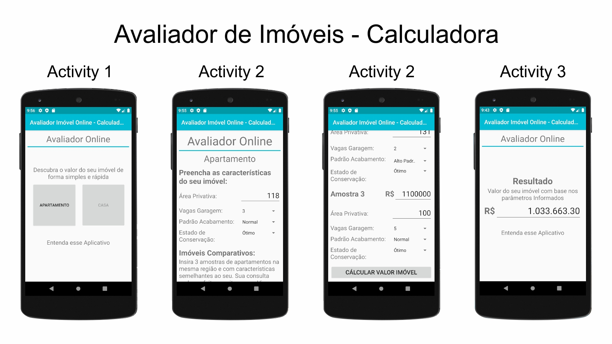

## Avaliador de imóveis Online

### Habilidades
 Kotlin, Android Studio, Padrão MVP

### Introdução
Desenvolvimento de uma aplicação Android para estimar o valor de imóvel de forma simples, atingindo um grau razoável de fundamentação com poucas informações fornecidas pelos usuários. 

### Objetivo
O objetivo é entregar um suporte básico de avaliação para quem pretende vender, alugar ou apenas ter uma ideia do quanto vale seu patrimônio

### Notas
 Remaster avaliador de imóveis online.
 
"# references" 
